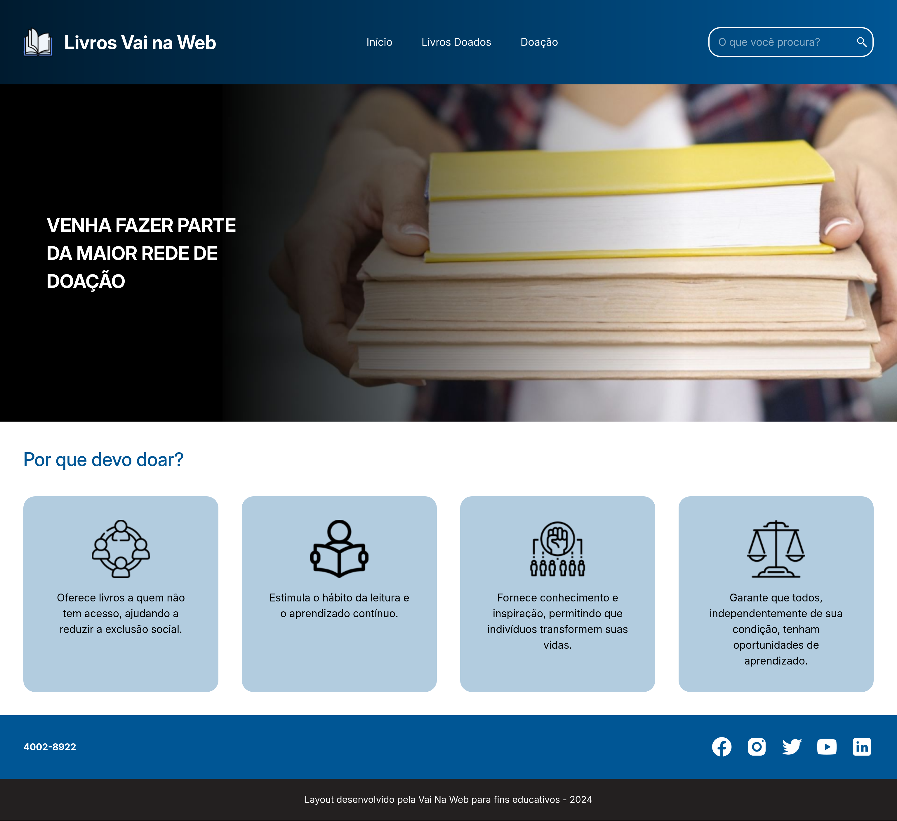
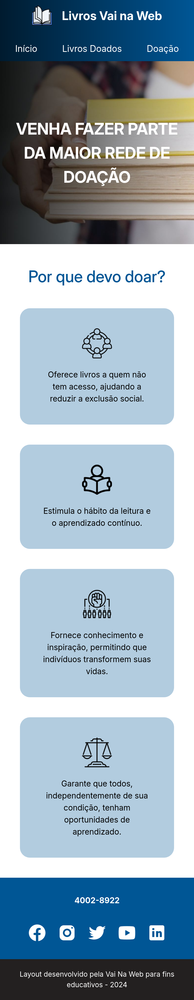

# 📚 Livros Vai na Web

Um site (ainda estático) para doação de livros, com o objetivo de facilitar o acesso à literatura e promover a leitura.

## 📚 Tabela de Conteúdos

- [📚 Livros Vai na Web](#-livros-vai-na-web)
  - [📚 Tabela de Conteúdos](#-tabela-de-conteúdos)
  - [📋 Descrição](#-descrição)
    - [🚀 Funcionalidades](#-funcionalidades)
    - [🌐 Acesso](#-acesso)
    - [📸 Prévia](#-prévia)
  - [⚙️ Construção](#️-construção)
    - [💻 Tecnologias](#-tecnologias)
    - [🛠️ Ferramentas](#️-ferramentas)
    - [📌 Versão](#-versão)
  - [✏️ Aprendizado](#️-aprendizado)
  - [✒️ Autores](#️-autores)
  - [🎁 Agradecimentos](#-agradecimentos)
  - [📨 Contato](#-contato)

## 📋 Descrição

**Livros Vai na Web** é um projeto desenvolvido como o desafio final do módulo 01 do curso **Full-Stack do Vai na Web**. Seu objetivo é oferecer uma plataforma (ainda não funcional) onde os usuários podem doar livros, visualizar os livros disponíveis para doação e entender a importância do hábito da leitura.

### 🚀 Funcionalidades

- Visualizar livros já doados, incluindo título, autor e categoria.
- Visualizar o processo de doar livros preenchendo informações como título, autor, categoria e link da imagem.
- Navegação responsiva, com uma interface otimizada para desktop e dispositivos móveis.

### 🌐 Acesso

🖇️ **Link do projeto:** 🖇️ [Clique aqui para acessar o projeto](https://milton-salgado.github.io/livros-vai-na-web/)

### 📸 Prévia

  

  

## ⚙️ Construção

Resumo geral dos recursos utilizados na construção do projeto.

### 💻 Tecnologias

Tecnologias utilizadas na construção do projeto:

### 🛠️ Ferramentas

Ferramentas utilizadas:

### 📌 Versão

Utilizei o Git para controle de versão.

Versão atual: 1.0 (primeira versão).

## ✏️ Aprendizado

Durante o desenvolvimento do projeto, aprendi a/revisei:

- Modularizar o projeto utilizando **SASS Modules** no React.
- Utilizar a arquitetura SASS para o estilo global, incluindo **mixins** e **variáveis**.
- Componentização no React, reforçando a manipulação de **Props** com **PropTypes**.
- Princípios básicos de design responsivo.

## ✒️ Autores

* **Milton Salgado Leandro** - *Todo o Projeto* - [GitHub](https://github.com/milton-salgado)

## 🎁 Agradecimentos

Agradeço ao **Vai na Web**, especialmente ao instrutor Vinicius Bispo e à facilitadora Marina Gomes, por todo suporte durante o curso.

## 📨 Contato

